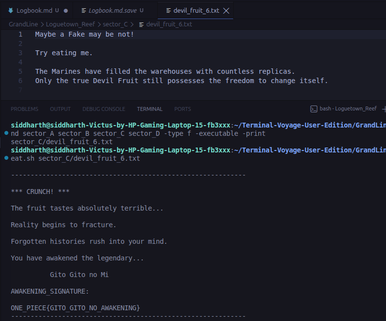
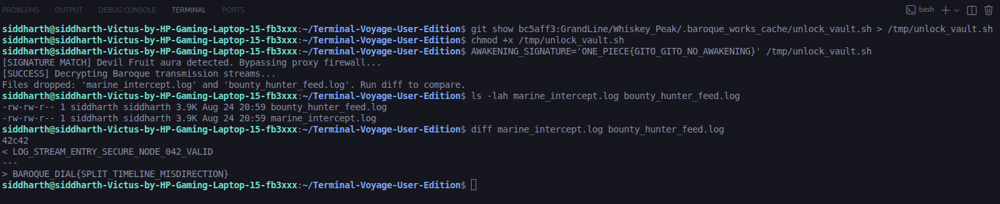
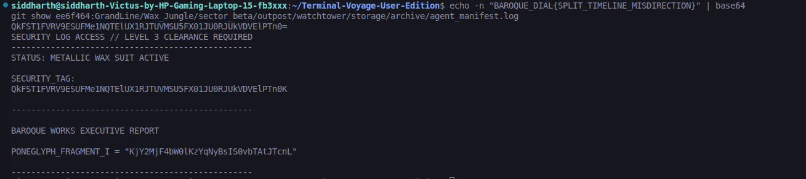
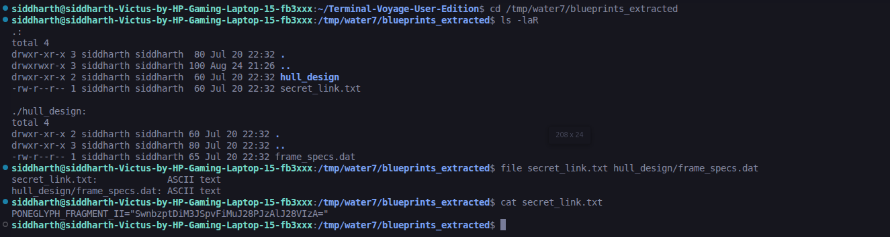
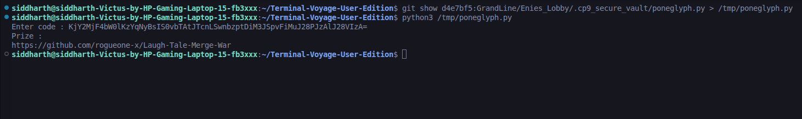
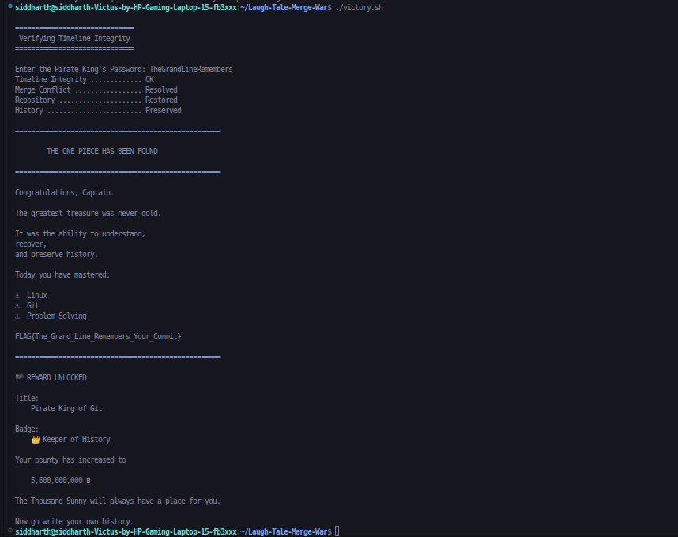

# 🏴‍☠️ Logbook of the Grand Line

## Task 02 — Prologue

### Captain's Log

This logbook records every flag, cipher fragment, transmission code,
keyword, command, and important discovery found during the Terminal Voyage.

---

## Level 1 — Awakening at Loguetown Reef

### Discovery

AWAKENING_SIGNATURE: ONE_PIECE{GITO_GITO_NO_AWAKENING}

The genuine Devil Fruit was found at:

sector_C/devil_fruit_6.txt

### Method

I first inspected `eat.sh` to understand how it identifies the genuine fruit.
The script checks whether the supplied file is executable using the `-x`
file test.

I then searched all four storage sectors for executable regular files using:

find sector_A sector_B sector_C sector_D -type f -executable -print

This revealed:

sector_C/devil_fruit_6.txt

I passed this file to the provided eating script:

./eat.sh sector_C/devil_fruit_6.txt

The script successfully awakened the Gito Gito no Mi and revealed the
AWAKENING_SIGNATURE.

### Screenshot



---

## Level 2 — The Two Faces of Whiskey Peak

### Objective

Recover the Executive Transmission Code hidden within the alternate history of Whiskey Peak.

### Discovery

EXECUTIVE TRANSMISSION CODE:

`BAROQUE_DIAL{SPLIT_TIMELINE_MISDIRECTION}`

### Method

I first inspected the visible files in the Whiskey Peak directory:

```bash
cd ~/Terminal-Voyage-User-Edition/GrandLine/Whiskey_Peak
ls -lah
cat feast_manifest.txt
```

The visible manifest contained:

```text
Item 01: 50 Barrels of Bink's Sake
Item 02: Roasted Sea King Meat
```

There was no transmission code in the visible timeline.

The Level 2 description mentioned that Whiskey Peak had another hidden history. Since the repository uses Git, I inspected the Git history:

```bash
git log --all --oneline --decorate --graph
```

This revealed a separate branch:

```text
bc5aff3 (origin/whiskey_peak_investigation) Level 2: Implemented
```

I then inspected the Whiskey Peak manifest from this alternate timeline without switching branches:

```bash
git show origin/whiskey_peak_investigation:GrandLine/Whiskey_Peak/feast_manifest.txt
```

The alternate version contained:

```text
Item 01: 50 Barrels of Sleep Powder Infused Sake
Item 02: Roasted Sea King Meat
```

This confirmed that the branch contained the hidden history mentioned in the challenge.

Next, I inspected the Level 2 implementation commit:

```bash
git show --stat bc5aff3
```

This revealed a hidden script:

```text
GrandLine/Whiskey_Peak/.baroque_works_cache/unlock_vault.sh
```

I inspected the script directly from the Git commit:

```bash
git show bc5aff3:GrandLine/Whiskey_Peak/.baroque_works_cache/unlock_vault.sh
```

The script required the `AWAKENING_SIGNATURE` obtained in Level 1. It calculated the SHA-256 hash of the signature and compared it with a target hash.

I extracted the historical script and executed it using the Level 1 signature:

```bash
git show bc5aff3:GrandLine/Whiskey_Peak/.baroque_works_cache/unlock_vault.sh > /tmp/unlock_vault.sh
chmod +x /tmp/unlock_vault.sh
AWAKENING_SIGNATURE='ONE_PIECE{GITO_GITO_NO_AWAKENING}' /tmp/unlock_vault.sh
```

The vault successfully authenticated the Devil Fruit signature and generated two transmission logs:

```text
marine_intercept.log
bounty_hunter_feed.log
```

The script instructed me to compare the two files using `diff`.

I therefore ran:

```bash
diff marine_intercept.log bounty_hunter_feed.log
```

The output showed that line 42 differed:

```text
42c42
< LOG_STREAM_ENTRY_SECURE_NODE_042_VALID
---
> BAROQUE_DIAL{SPLIT_TIMELINE_MISDIRECTION}
```

The altered line contained the Executive Transmission Code.

### Screenshot



---

## Level 3 — The Wax Labyrinth of Little Garden

### Objective
Locate the authentic Baroque Works Executive Report among the decoy logs in the Wax Jungle using the broadcast representation of the Level 2 Executive Transmission Code.

### Discovery
- **EXECUTIVE TRANSMISSION CODE:** `BAROQUE_DIAL{SPLIT_TIMELINE_MISDIRECTION}`
- **BROADCAST IDENTIFIER (SECURITY_TAG):** `QkFST1FVRV9ESUFMe1NQTElUX1RJTUVMSU5FX01JU0RJUkVDVElPTn0K`
- **GENUINE REPORT:** `GrandLine/Wax_Jungle/sector_beta/outpost/watchtower/storage/archive/agent_manifest.log`
- **PONEGLYPH_FRAGMENT_I:** `KjY2MjF4bW0lKzYqNyBsIS0vbTAtJTcnL`

### Method
1. Inspected the file tree of the `origin/little_garden` branch (`ee6f464`) using `git ls-tree -r ee6f464 GrandLine/Wax_Jungle`.
2. Encoded the Level 2 transmission code into Base64 (`echo 'BAROQUE_DIAL{SPLIT_TIMELINE_MISDIRECTION}' | base64`), yielding `QkFST1FVRV9ESUFMe1NQTElUX1RJTUVMSU5FX01JU0RJUkVDVElPTn0K`.
3. Inspected `GrandLine/Wax_Jungle/sector_beta/outpost/watchtower/storage/archive/agent_manifest.log` directly via `git show`.
4. Verified that the `SECURITY_TAG` matched the broadcast code and extracted `PONEGLYPH_FRAGMENT_I`.

### Screenshot


## Level 4 — The Camouflaged Blueprints of Water 7

### Objective
Recover the disguised Sea Train blueprints in Water 7 by recursively identifying and unpacking nested archive layers to retrieve Cipher Fragment 2.

### Discovery
- **TARGET FILE:** `GrandLine/Water_7/galley_la_company/puffing_tom_blueprints`
- **NESTED ARCHIVE CHAIN:** Gzip (`step2_blueprints.tar`) $\rightarrow$ GNU Tar (`step1_blueprints.zip`) $\rightarrow$ Zip Archive (`blueprints_extracted/`)
- **AUTHENTIC RECORD:** `blueprints_extracted/secret_link.txt`
- **PONEGLYPH_FRAGMENT_II:** `SwnbzptDiM3JSpvFiMuJ28PJzAlJ28VIzA=`

### Method
1. Inspected `GrandLine/Water_7/galley_la_company/` and checked the binary signature of the un-extended blueprint file:
   ```bash
   file puffing_tom_blueprints

Identified that the file was Gzip compressed data containing step2_blueprints.tar.
2. Copied the archive to /tmp/water7 and decompressed Layer 1:

```bash

mkdir -p /tmp/water7 && cd /tmp/water7
cp ~/Terminal-Voyage-User-Edition/GrandLine/Water_7/galley_la_company/puffing_tom_blueprints layer1.gz
gunzip layer1.gz 

```
Extracted Layer 2 (POSIX tar archive):
```bash 
tar -xvf layer1
# Got step1_blueprints.zip
```
Extracted Layer 3 (Zip archive):
```bash 
unzip step1_blueprints.zip
# Unpacked directory : blueprints_extracted/
```
Inspected the extracted files and read secret_link.txt:

```bash 
cat blueprints_extracted/secret_link.txt
```
Retrieved PONEGLYPH_FRAGMENT_II.


### Screenshot


---

## Level 5 — The Buster Call Timeline Recovery

### Objective
Recover the historical state of Enies Lobby prior to the Buster Call destruction, reconstruct the complete Poneglyph inscription from Fragments I & II, and decrypt the cipher using the CP9 secure vault mechanism.

### Discovery
- **RESTORED COMMIT:** `d4e7bf5` ("Level 5 : Vault Sealed")
- **VAULT SCRIPT:** `GrandLine/Enies_Lobby/.cp9_secure_vault/poneglyph.py`
- **COMBINED INSCRIPTION:** `KjY2MjF4bW0lKzYqNyBsIS0vbTAtJTcnLSwnbzptDiM3JSpvFiMuJ28PJzAlJ28VIzA=`
- **DECIPHERED PRIZE (LEVEL 6 REPOSITORY):** `https://github.com/rogueone-x/Laugh-Tale-Merge-War`

### Method
1. Inspected the Git graph to locate the historical commit prior to evidence erasure:
```bash
git log --all --oneline --decorate --graph
```
Commits 23b4e67 and c337460 indicated that evidence was erased, identifying commit d4e7bf5 ("Level 5 : Vault Sealed") as the target pre-destruction commit.

2. Listed the files preserved within commit d4e7bf5:

```Bash
git ls-tree -r d4e7bf5
```
This revealed the secure cipher script located at GrandLine/Enies_Lobby/.cp9_secure_vault/poneglyph.py.

3. Inspected the cipher implementation:

```Bash
git show d4e7bf5:GrandLine/Enies_Lobby/.cp9_secure_vault/poneglyph.py
```
The Python script decodes a Base64-encoded input and applies a byte-wise XOR operation using the hex key 0x42.

4. Concatenated the two Poneglyph fragments recovered from Level 3 and Level 4 into a unified string:

```text

KjY2MjF4bW0lKzYqNyBsIS0vbTAtJTcnLSwnbzptDiM3JSpvFiMuJ28PJzAlJ28VIzA=
```
5. Extracted and executed the vault script:

```Bash
git show d4e7bf5:GrandLine/Enies_Lobby/.cp9_secure_vault/poneglyph.py > /tmp/poneglyph.py
python3 /tmp/poneglyph.py
```

### Screenshot


---

### Level 6 — The Great Merge War at Laugh Tale

### Objective
Resolve the conflicting histories between the ancient timeline and pirate king records on Laugh Tale, reconstruct the Pirate King's password by reconciling the fractured Poneglyph records, and unlock the final treasure vault.

### Discovery
- **REPOSITORY:** `https://github.com/rogueone-x/Laugh-Tale-Merge-War`
- **CONFLICTING BRANCHES:** `ancient_history` and `origin/pirate_king_path`
- **RECONCILED FRAGMENTS:**
  - `treasure/key_part_1.txt`: `Line` + `TheGrand` $\rightarrow$ `TheGrandLine`
  - `treasure/key_part_2.txt`: `bers` + `Remem` $\rightarrow$ `Remembers`
- **PIRATE KING'S PASSWORD:** `TheGrandLineRemembers`
- **EXPECTED SHA-256 HASH:** `2abfc485e42e701824a6340b3b12e54f0dfad6647d56fb095b50bd4d6384700e`
- **FINAL FLAG:** `FLAG{The_Grand_Line_Remembers_Your_Commit}`
- **REWARD:** Title *Pirate King of Git* | Badge *👑 Keeper of History* | Bounty: `5,600,000,000 ฿`

### Method
1. Cloned the Laugh Tale repository and inspected the divergent branches and commit history:
```bash
cd ~
git clone [https://github.com/rogueone-x/Laugh-Tale-Merge-War](https://github.com/rogueone-x/Laugh-Tale-Merge-War)
cd Laugh-Tale-Merge-War
git branch -a
git log --all --oneline --decorate --graph
```
2. Attempted to merge the origin/pirate_king_path branch into ancient_history:

```Bash
git merge origin/pirate_king_path
Git reported content merge conflicts in treasure/key_part_1.txt and treasure/key_part_2.txt.
```
3. Inspected victory.sh to determine the validation requirements:

```Bash
cat victory.sh
The script verifies that working directory diffs are completely resolved and tests the SHA-256 hash of the entered password.
```
4. Resolved the merge conflicts by reconciling the split inscriptions from both timelines:

- In treasure/key_part_1.txt, merged TheGrand and Line into TheGrandLine.

- In treasure/key_part_2.txt, merged Remem and bers into Remembers.

5. Staged the resolved files and completed the merge commit:

```Bash
git add treasure/key_part_1.txt treasure/key_part_2.txt
git commit -m "Reconcile ancient history and pirate king records"
```
6. Executed the victory script and entered the restored password:

```Bash
./victory.sh
Entered TheGrandLineRemembers when prompted, successfully verifying repository timeline integrity and retrieving FLAG{The_Grand_Line_Remembers_Your_Commit}.
```
### Screenshot

