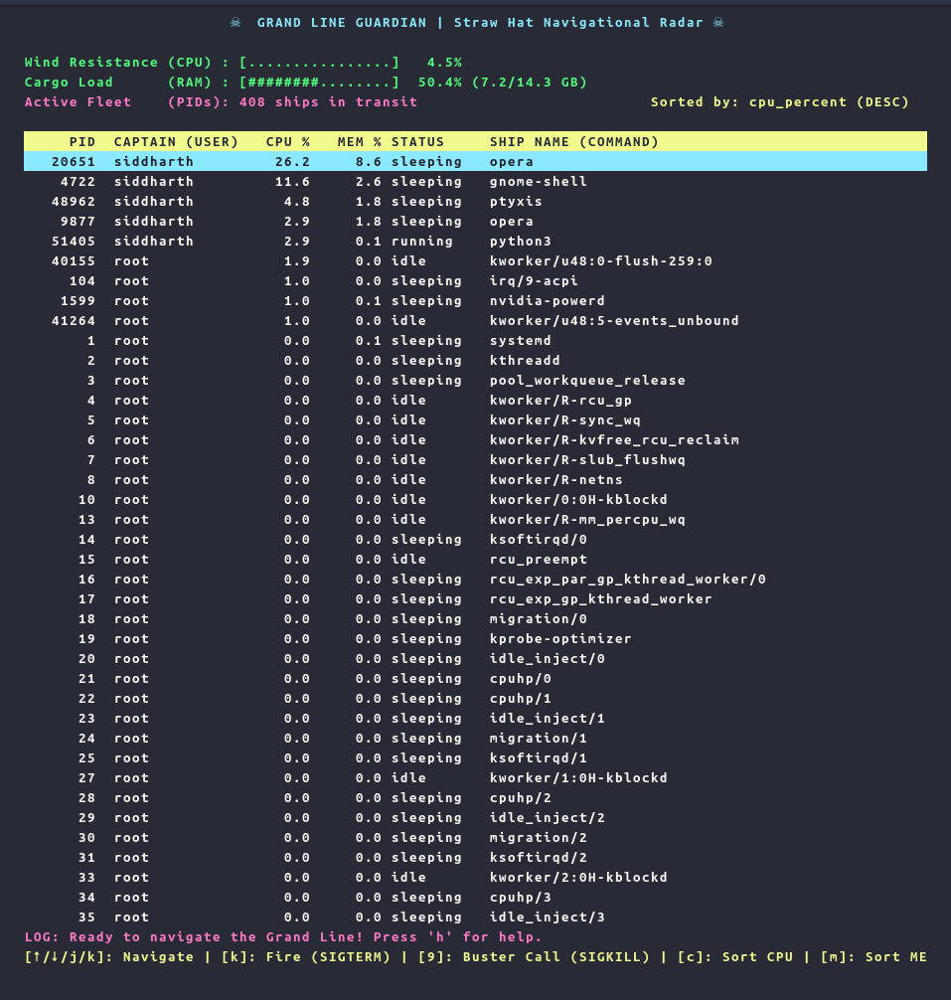

# ☠ Grand Line Guardian (Task 05)

A terminal-based real-time process monitoring tool inspired by `htop` and themed around navigating the Grand Line. It monitors running processes ("ships"), tracks CPU and memory load, and provides real-time signal dispatching (`SIGTERM`/`SIGKILL`) via interactive keyboard controls.

---

## 1. Approach & Architecture

The application is built in three primary layers:

* **Kernel Interface Layer (`psutil` / `/proc`)**: Samples operating system metrics, memory allocations, CPU time slices, and thread states from the Linux virtual filesystem.
* **State Engine (`ProcessMonitor`)**: Manages process filtering, dynamic multi-column sorting (CPU, Memory, PID), table scroll offsets, and signal dispatching (`SIGTERM`/`SIGKILL`).
* **Terminal UI Layer (`curses`)**: Implements an interactive, non-blocking rendering loop with sub-second polling (750ms), responsive terminal resizing, ANSI color indicators, and keyboard event handling.

---

## 2. Linux Kernel Interface & Process Management (`/proc`)

On Linux systems, process monitoring relies on the virtual filesystem mounted at `/proc` (`procfs`). This filesystem exists purely in memory and is generated dynamically by the Linux kernel to expose system and process state:

* **`/proc/stat`**: Stores global CPU execution ticks across user mode, system mode, idle time, and I/O wait. Instantaneous CPU load is computed by sampling ticks across time deltas:
  $$\text{CPU \%} = \frac{\Delta \text{Active Ticks}}{\Delta \text{Total Ticks}} \times 100$$
* **`/proc/meminfo`**: Exposes kernel memory counters including `MemTotal`, `MemFree`, `Buffers`, and `Cached` to compute active physical RAM utilization.
* **`/proc/[pid]/stat`**: Contains per-process execution counters (`utime` for user mode ticks, `stime` for kernel mode ticks, and priority scheduling flags).
* **`/proc/[pid]/status`**: Exposes human-readable memory footprints (`VmRSS` for resident set size, `VmSize` for virtual memory) and current execution status (`R` for Running, `S` for Sleeping, `Z` for Zombie).
* **POSIX Signals**: Dispatches process termination directly via standard kernel system calls:
  * `SIGTERM` (Signal 15): Requests graceful termination, allowing processes to clean up resources.
  * `SIGKILL` (Signal 9): Forces immediate kernel-enforced termination.

## Screenshot


---

## 3. Installation & Usage

### Prerequisites
* Python 3.8+
* Linux / macOS / WSL

### Setup

```bash
# 1. Create and activate virtual environment
python3 -m venv venv
source venv/bin/activate

# 2. Install dependencies
pip install -r requirements.txt

# 3. Run Grand Line Guardian
python3 guardian.py

Note: Run with elevated permissions (sudo ./venv/bin/python3 guardian.py) to manage root-owned system daemons.
```
## 4. Controls & Navigation

| Key | Action |
| :--- | :--- |
| `↑` / `k` | Move cursor up |
| `↓` / `j` | Move cursor down |
| `c` | Sort by CPU Usage (%) |
| `m` | Sort by Memory Usage (%) |
| `p` | Sort by Process ID (PID) |
| `/` | Search / Filter by process name or PID |
| `x` | Cannon Fire (`SIGTERM`) - Graceful termination |
| `9` | Buster Call (`SIGKILL`) - Forced termination |
| `q` | Quit application |

---

## 5. Concepts Learned

* **Virtual Filesystems (`procfs`)**: How Linux abstracts process tables and kernel diagnostics into an in-memory hierarchical directory structure.
* **Non-Blocking Curses I/O**: Implementing non-blocking input timeouts (`nodelay(True)`, `timeout(500)`) to maintain continuous screen updates without freezing the event loop.
* **Process Lifecycle Handling**: Handling race conditions (`NoSuchProcess`, `AccessDenied`, `ZombieProcess`) when processes terminate between polling cycles.
* **POSIX Process Signaling**: The functional difference between user-catchable signals (`SIGTERM`) and direct kernel-handled terminations (`SIGKILL`).

---
